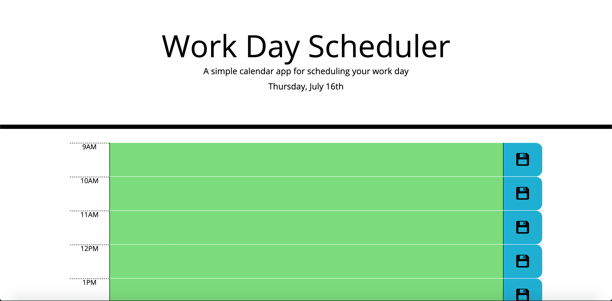
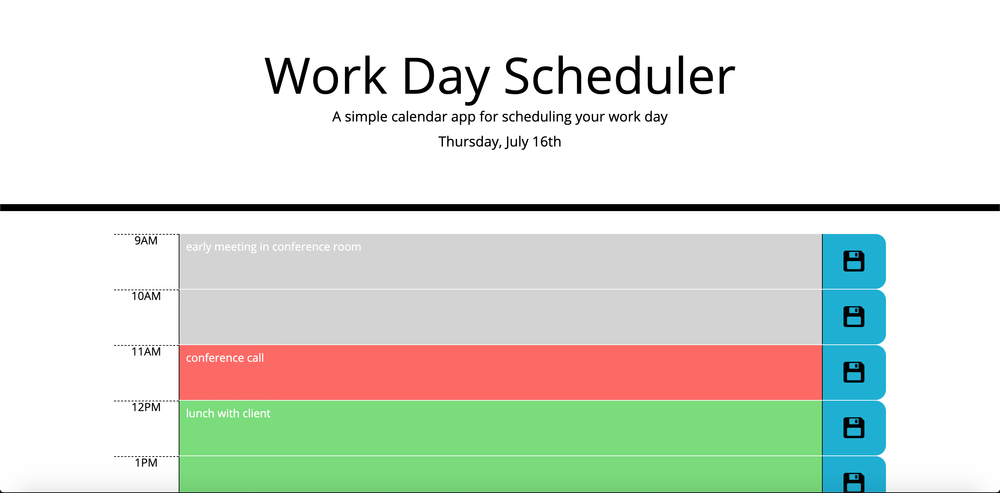

# work-day-scheduler
# 05 Third-Party APIs: Work Day Scheduler

https://elwiller.github.io/work-day-scheduler/

This is a simple work day schedule planner.

The user can add, edit, and delete events in the description area.

Pushing the save icon to the right saves the planner to local storage.

As the day progresses, past hours turn grey, the current hour is in red, and future hours are green.

